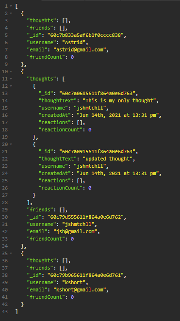

# social-network-api
This project is a social media back-end API. It allows users to share their thoughts, are able to react to friend's thoughts, and create a friends list.



## Tools and languages used
* MongoDB 
* Mongoose
* Express.js
* Node.js

## Installation and Setup
 * Clone this repo to your machine
 * Install dependencies
 ```npm i```
 
 ## Usage
 * To start the application once everything is installed you can run ```npm start``` to start the process and create your network
  
 ## Demo
 You can view a walkthrough video of the app [here](https://drive.google.com/file/d/1rlEWKrbl8kTYETMCiNlu90iErFV4CkIC/view?usp=sharing)